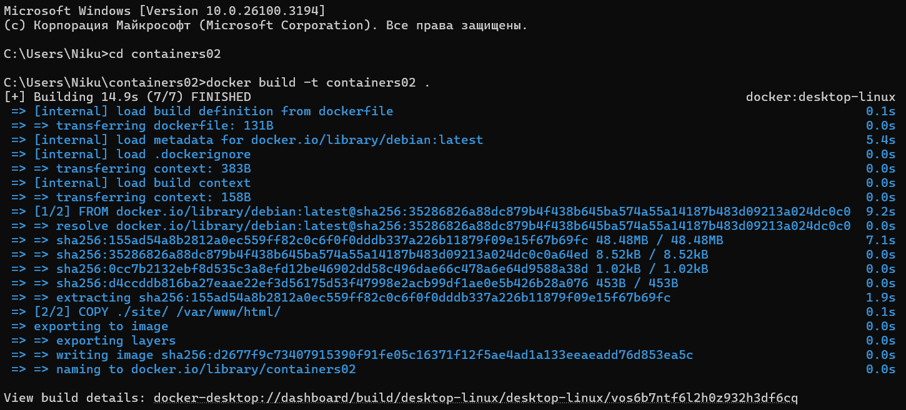
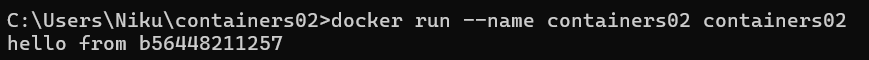
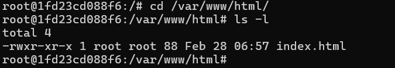

## Prima aplicație Docker

### Scopul lucararii:

Aceasta lucrare de laborator familiarizează cu elementele de bază ale 
containerizării și pregătește spațiul de lucru pentru 
următoarele lucrări de laborator.

### Sarcina:

Instalarea Docker Desktop și verificarea funcționării acestuia.

### Descrierea executării lucrării cu răspunsuri la întrebări: 

Descărcați și instalați Docker Desktop.

Creați un repozitoriu containers02 și clonați-l pe computerul dvs.

Creați în directorul containers02 fișierul Dockerfile cu următorul conținut:

    FROM debian:latest
    COPY ./site/ /var/www/html/
    CMD ["sh", "-c", "echo hello from $HOSTNAME"]

În aceeași director de proiect creați directorul site. 
În noul director creați fișierul index.html cu conținut arbitrar.

Deschideți terminalul în directorul containers02 și executați comanda:

    docker build -t containers02 .

*Cât timp a durat crearea imaginii?*

Conform imaginii observam ca crearea imaginii a durat 14.9 sec

Executați comanda pentru a porni containerul:

    docker run --name containers02 containers02

*Ce a fost afișat în consolă?*

Observam ca a fost afisat textul nostru "hello from" si HOSTNAME curent;

Ștergeți containerul și porniți-l din nou, executând comenzile:

    docker rm containers02
    docker run -ti --name containers02 containers02 bash

În fereastra deschisă, executați comenzile:

    cd /var/www/html/
    ls -l

*Ce este afișat pe ecran?*

Închideți fereastra cu comanda:

    exit

### Concluzii:
In aceasta lucrarea ne-am familiarizat cu elementele de bază ale 
containerizării am instalat, creat si pornit un dockerfile foarte simplu.
Am vazut sintaxa la Docker  si am creat o mica baza pentru temele care vor continua. Pregatind si spațiul de lucru pentru 
următoarele lucrări de laborator.
### Bibliografie:
[moodle](https://moodle.usm.md/mod/assign/view.php?id=282515)